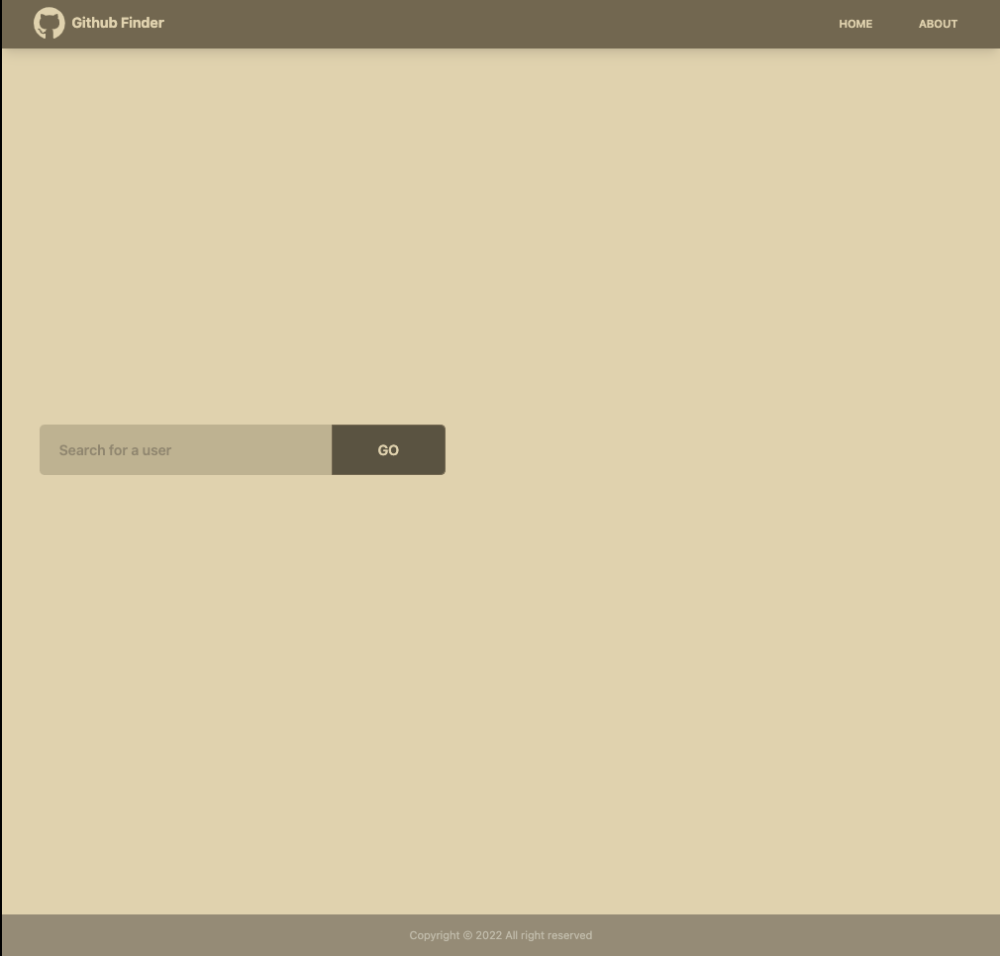
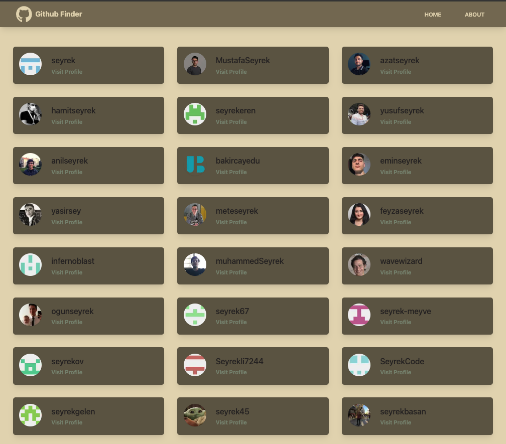
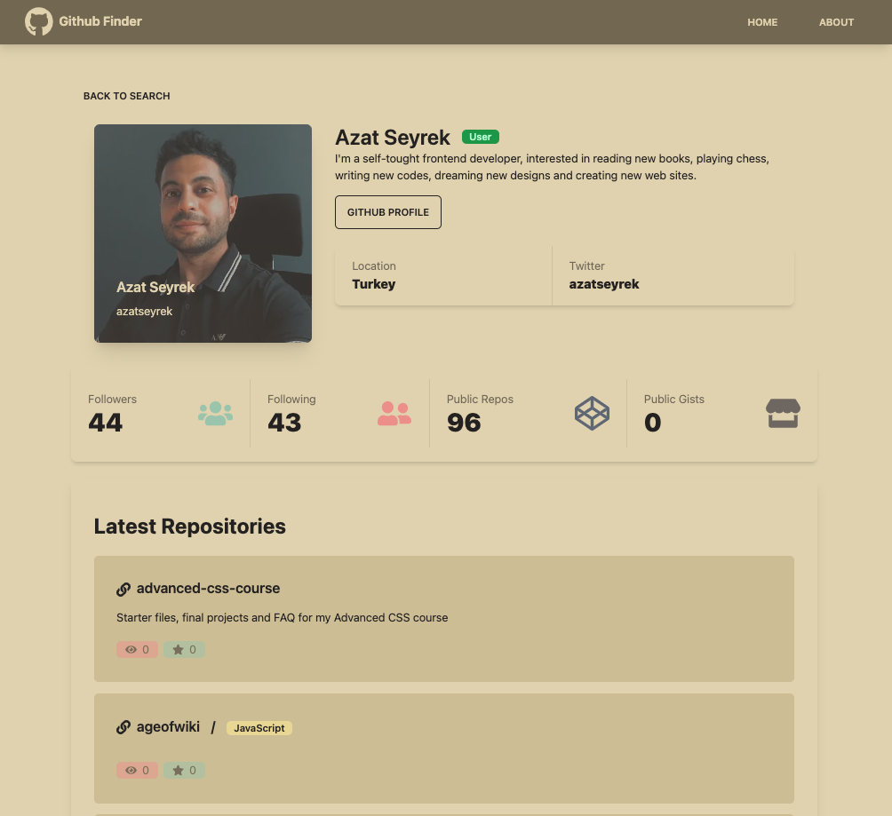

# GITHUB API APP WITH NEXTJS (AZAT SEYREK OKR)

<h1 align="center">⚡ GITHUB HRAPP ⚡</h1>

DEMO : <a href="https://githubfinder-nextjs-okr-a9ik.vercel.app">Demo Link</a>

This is GITHUB HRAPP  built on  NextJS

<h2 align="center">Project Details </h2>

- You can search github users
- You can get more detail about searched users
- You can review users repos

<h2 align="center">Technologies</h2>

- NextJS
- ContextApi
- TailwindCSS

# Project images

DEMO : <a href="https://githubfinder-nextjs-okr-a9ik.vercel.app">Demo Link</a>
